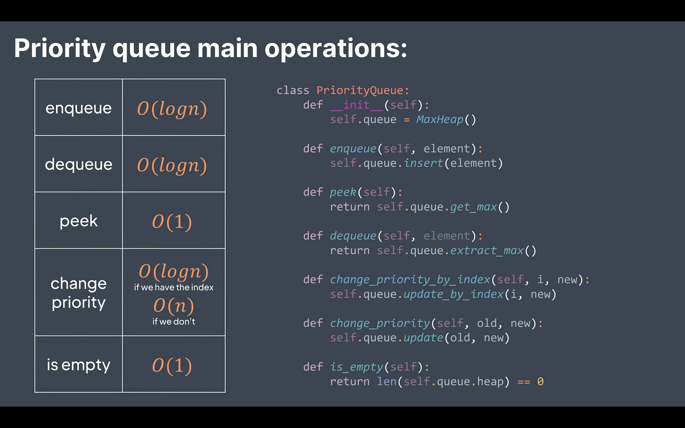

# DSA Theory and Notes

## Heaps And Priority Queue
### Heaps
* Min heap - Every child is larger or equal to its parent
  * Naturally, root is the smallest element
* Max heap - Every child is smaller or equal to its parent
  * Naturally, root is the largest element
  
#### Time Complexity of Basic Operations


#### Heap Sort
* Heapify the array to be sorted - O(n)
* Remote the root while sifting what is left - O(nlog(n))
* Overall time complexity - O(nlog(n))

### Prioirity Queue
* A practical application of heap, basically it is just a heap, the highest priority element is at the root

#### Time Complexity of Basic Operations


You can use Java Priority Queue as a Heap.

Min Heap: --> to keep the min element always on top, so you can access it in O(1).
```java
PriorityQueue<Integer> minHeap = new PrioirtyQueue<>();
```
Max Heap: --> to keep the max element always on top, the same order as above.
```java
PriorityQueue<Integer> maxHeap = new PriorityQueue<>(Comparator.reverseOrder());
```
Which is the same as ```java(Integer o1, Integer o2) -> Integer.compare(o2, o1) or - Integer.compare(o1, o2)```.

And you can use:
* add --> to add element to the queue. O(log n)
* remove --> to get and remove the min/max. O(log n)
* peek --> to get, but not remove the min/max. O(1)

