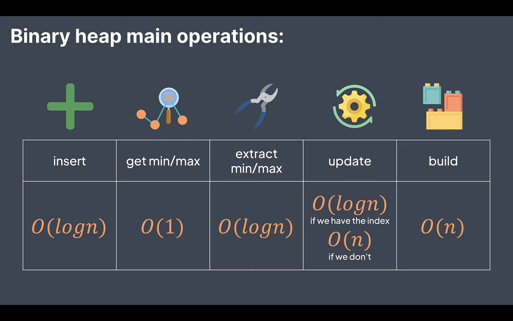

# DSA Theory and Notes

## Heaps
* Min heap - Every child is larger or equal to its parent
  * Naturally, root is the smallest element
* Max heap - Every child is smaller or equal to its parent
  * Naturally, root is the largest element
  
### Time Complexity of Basic Operations

### Heap Sort
* Heapify the array to be sorted - O(n)
* Remote the root while sifting what is left - O(nlog(n))
* Overall time complexity - O(nlog(n))

## Prioirity Queue
* A practical application of heap, basically it is just a heap, the highest priority element is at the root

### Time Complexity of Basic Operations

